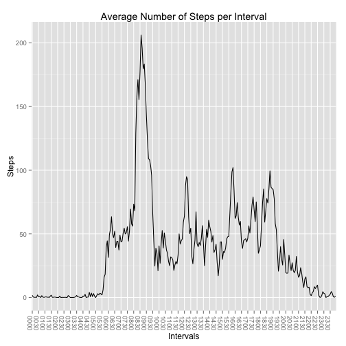
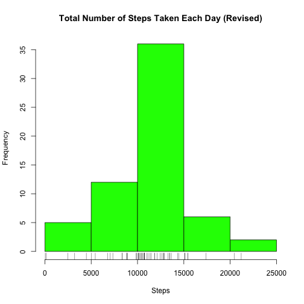

# Reproducible Research: Peer Assessment 1


## Loading and preprocessing the data

__Show any code that is needed to__

* __Load the data (i.e. read.csv())__


```r
df_activity <- read.csv("activity.csv")
```


* __Process/transform the data (if necessary) into a format suitable for your analysis__


```r
# Convert the raw date representation to a Date() format.
day <- strptime(as.character(df_activity[, 2]), format = "%Y-%m-%d")
# Convert the time to 2400 hour time (always 4 digits)
mins <- sprintf("%04d", df_activity[, 3])
# Combine the date and time.
datetime <- strptime(paste(as.character(df_activity[, 2]), as.character(sprintf("%04d00", 
    df_activity[, 3]))), format = "%Y-%m-%d %H%M%S")
# Extend the data frame to include these new date/time columns.
df_activity <- data.frame(df_activity, day, mins, datetime)
```


## What is mean total number of steps taken per day?

__For this part of the assignment, you can ignore the missing values in the dataset.__

* __Make a histogram of the total number of steps taken each day__


```r
# Determine the steps per day.
df_part1 <- aggregate(steps ~ day, data = df_activity, FUN = sum)
# Plot using base plot.
hist(df_part1[, 2], main = "Total Number of Steps Taken Each Day", xlab = "Steps", 
    col = "red")
rug(df_part1[, 2])
```

 


* __Calculate and report the mean and median total number of steps taken per day__


```r
steps_mean <- mean(df_part1[, 2])
steps_median <- median(df_part1[, 2])
```


The mean is 10766.19.  
The median is 10765.00.

## What is the average daily activity pattern?

* __Make a time series plot (i.e. type = "l") of the 5-minute interval (x-axis) and the average number of steps taken, averaged across all days (y-axis)__

Instead of using the base plotting system, I've chosen the ggplot2 plotting system.


```r
# Determine the steps per 5 minute interval.
df_part2 <- aggregate(steps ~ mins, data = df_activity, FUN = mean)
# Plot using ggplot2.
library(ggplot2)
plot2 <- ggplot(data = df_part2, aes(x = mins, y = steps, group = 1))
plot2 <- plot2 + xlab("Intervals") + ylab("Steps")
plot2 <- plot2 + ggtitle("Average Number of Steps per Interval")
plot2 <- plot2 + scale_x_discrete(breaks = df_part2[, "mins"][seq(1, length(df_part2[, 
    "mins"]), by = 6)])
plot2 <- plot2 + theme(axis.text.x = element_text(angle = -90, hjust = 1))
plot2 <- plot2 + geom_line()
plot2
```

 


* __Which 5-minute interval, on average across all the days in the dataset, contains the maximum number of steps?__


```r
steps_max <- max(df_part2[, "steps"])
interval_max <- df_part2[df_part2[, "steps"] == steps_max, "mins"]
```


The 5-minute interval containing the max number of steps (206.1698) is 0835.

## Imputing missing values

__Note that there are a number of days/intervals where there are missing values (coded as NA). The presence of missing days may introduce bias into some calculations or summaries of the data.__

* __Calculate and report the total number of missing values in the dataset (i.e. the total number of rows with NAs)__


```r
rows_total <- nrow(df_activity)
rows_complete <- sum(complete.cases(df_activity))
rows_incomplete <- rows_total - rows_complete
```


Subtract the number of fully populated rows (15264) from the total number of rows (17568) to determine the number of rows with missing values: 2304

* __Devise a strategy for filling in all of the missing values in the dataset. The strategy does not need to be sophisticated. For example, you could use the mean/median for that day, or the mean for that 5-minute interval, etc.__


```r
cnt_missing_steps <- length(which(is.na(df_activity[, "steps"])))
cnt_missing_dates <- length(which(is.na(df_activity[, "date"])))
cnt_missing_intervals <- length(which(is.na(df_activity[, "interval"])))
```

First, determine which columns have missing data:

* steps: 2304 missing values  
* dates: 0 missing values  
* intervals: 0 missing values

Thus, a strategy needs to be devised to deal with the 2304 missing values for the _steps_ column.

One solution is to substitute the rounded mean of the corresponding 5-minute interval (from df_part2 above).

* __Create a new dataset that is equal to the original dataset but with the missing data filled in.__


```r
# Determine the rows which have NA
rows_with_missing_values <- which(is.na(df_activity[, "steps"]))

# Instructions specify to create a new dataset.
df_activity_new <- df_activity

for (row in rows_with_missing_values) {
    # Get the interval corresponding row with missing steps.
    tgt_mins <- df_activity_new[row, "mins"]
    # Use this interval to find the corresponding mean.
    df_activity_new[row, "steps"] <- round(df_part2[df_part2[, "mins"] == tgt_mins, 
        "steps"])
}

# For verification purposes.
rows_total_new <- nrow(df_activity_new)
rows_complete_new <- sum(complete.cases(df_activity_new))
```


Checksum: The total number of rows in the updated dataset (17568) is equal to the number of fully populated rows (17568) in the updated dataset.

* __Make a histogram of the total number of steps taken each day and Calculate and report the mean and median total number of steps taken per day. Do these values differ from the estimates from the first part of the assignment? What is the impact of imputing missing data on the estimates of the total daily number of steps?__


```r
# Determine the steps per day.
df_part3 <- aggregate(steps ~ day, data = df_activity_new, FUN = sum)
# Plot using base plot.
hist(df_part3[, 2], main = "Total Number of Steps Taken Each Day (Revised)", 
    xlab = "Steps", col = "green")
rug(df_part3[, 2])
```

 

```r
steps_mean_new <- mean(df_part3[, 2])
steps_median_new <- median(df_part3[, 2])
pct_change_mean <- (steps_mean_new/steps_mean) * 100
pct_change_median <- (steps_median_new/steps_median) * 100
```


The revised mean/median differ nominally from the original mean/median:

* Original (with NAs) mean: 10766.19
* Revised (imputed values) mean: 10765.64
* Original (with NAs) median: 10765.00
* Revised (imputed values) median: 10762.00

The effect of imputing is that both the mean and the median are slightly lowered; specifically, the revised mean is 99.9949% of the original mean and the revised median is 99.9721% of the original median.

## Are there differences in activity patterns between weekdays and weekends?

__For this part the weekdays() function may be of some help here. Use the dataset with the filled-in missing values for this part.__

* __Create a new factor variable in the dataset with two levels – “weekday” and “weekend” indicating whether a given date is a weekday or weekend day.__

* __Make a panel plot containing a time series plot (i.e. type = "l") of the 5-minute interval (x-axis) and the average number of steps taken, averaged across all weekday days or weekend days (y-axis).__
